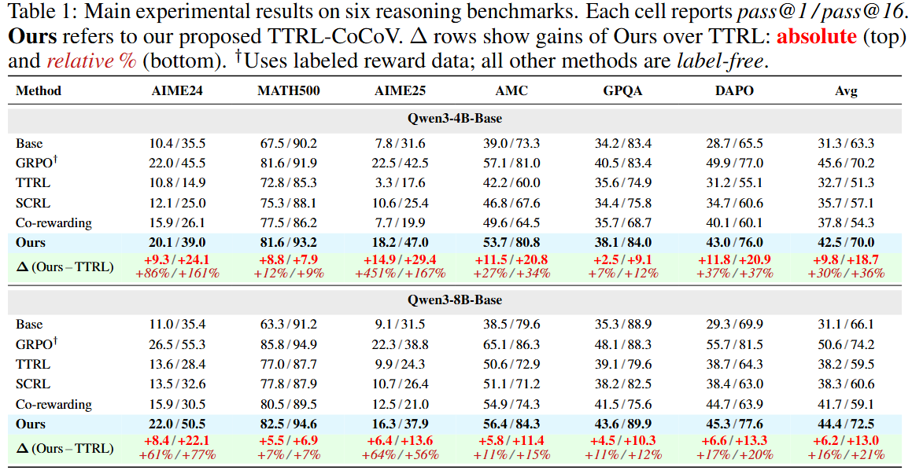
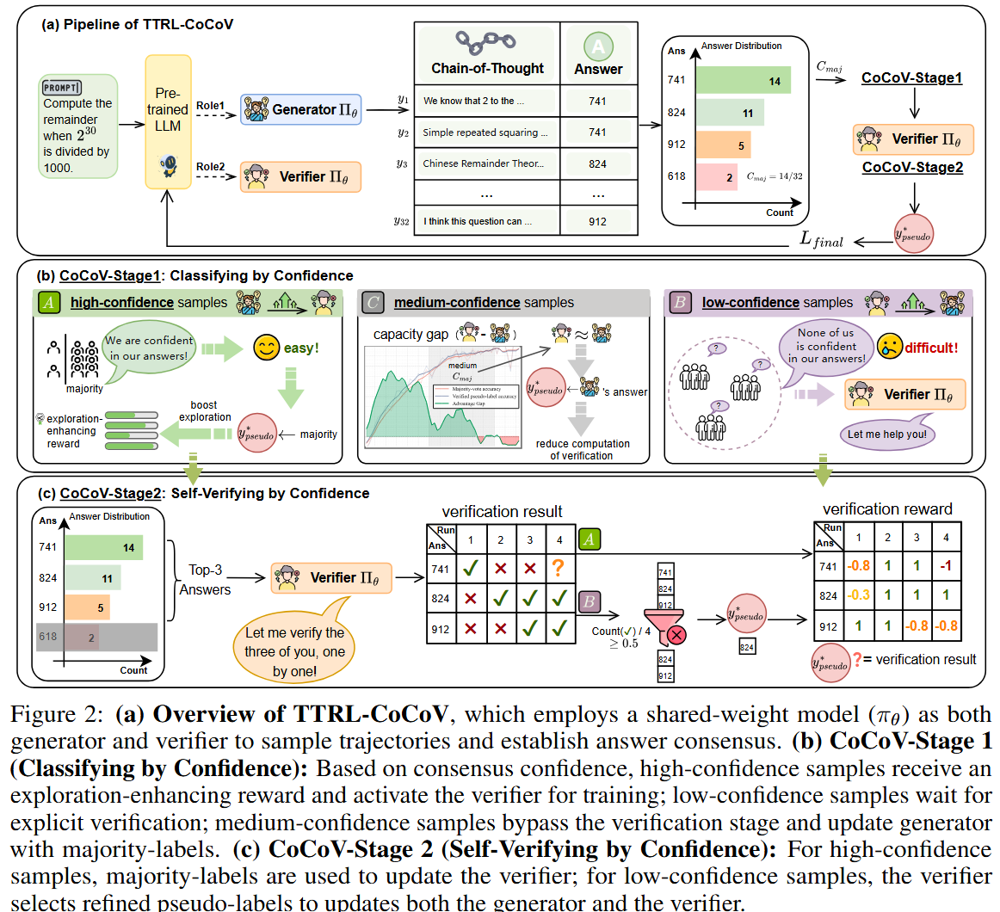

# TTRL-CoCoV

**Test-Time Reinforcement Learning with Confidence Conditioned Verification**

A label-free RL framework for LLM mathematical reasoning. A single shared-weight model serves as both generator and verifier: it samples reasoning trajectories, builds answer consensus, and — guided by that consensus confidence — selectively activates a self-verification stage to filter noisy pseudo-labels. An exploration-enhancing length-diversity reward prevents trajectory collapse on mastered problems.

---

## Key Results

<p align="center">
   
</p>


## Overview

Standard TTRL uses majority-voting self-consistency as a proxy reward,
but directly adapting Pass@k optimization to this label-free setting 
faces three fundamental challenges: **(1)** exploratory signals from 
low-confidence samples introduce severe pseudo-label noise; **(2)** 
response length standard deviation collapses as a latent precursor to 
accuracy stagnation; **(3)** naive Pass@k formulations consequently 
fail to expand the hypothesis space. TTRL-CoCoV resolves all three 
with two targeted components.
<p align="center">
   
</p>

### 1. Confidence-Conditioned Routing (Stage 1)

For each prompt, the model generates $N$ trajectories and extracts $K$ candidate answers. The majority-answer proportion $C_{maj}$ serves as an internal confidence signal. Samples are classified into three zones:

| Zone | Condition | Generator Update | Verifier Activated? | Rationale |
|---|---|---|---|---|
| **A — High-Confidence** | $C_{maj} \ge \tau_{high}$ | Majority label + $R_{div}$ | ✅ Co-evolution training | Pseudo-labels are reliable; clean signal to bootstrap the verifier |
| **B — Low-Confidence** | $C_{maj} < \tau_{low}$ | Verified pseudo-label (if found) | ✅ Candidate filtering & Co-evolution training | High noise; verifier screens spurious candidates before update |
| **C — Medium-Confidence** | otherwise | Majority label only | ❌ Skipped | Verifier offers no exploitable advantage here |

### 2. Self-Verification (Stage 2)

When triggered, the model switches to verifier mode. For each candidate answer $o_k$, $m$ verification trajectories are generated via backward-substitution. The **Verification Pass Rate** is:

$$\text{VPR}(o_k) = \frac{1}{m}\sum_{j=1}^{m} \mathbb{I}[\text{verify}^{(j)}(o_k) = \text{True}]$$

- **Zone A**: Majority answer is the pseudo-label; verifier trained against it for co-evolution.
- **Zone B**: Only candidates with VPR > 0.5 are trusted; the highest-consensus candidate among them is the pseudo-label. If none pass, the sample is skipped.

Verifier rewards use an asymmetric matrix that penalizes false positives more heavily than false negatives, shaping the verifier into a stringent filter.

### 3. Pass@k Advantage with Exploration Reward

Replaces standard GRPO normalization with a **combinatorial Pass@k advantage** based on the hypergeometric distribution:

$$\hat{A}{\text{pos}} = \frac{1 - \bar{R}^{\text{group}}}{\sigma^{\text{group}}}, \qquad \hat{A}{\text{neg}} = \left(1 - \bar{R}^{\text{group}} - \frac{\binom{N_{\text{neg}}-1}{k-1}}{\binom{N-1}{k-1}}\right) \cdot (\sigma^{\text{group}})^{-1}.$$

In Zone A, a **length-diversity reward** encourages varied reasoning paths:

$$R_{div}(y_i) = \lambda \cdot \min\left( \frac{|l_i - \mu_L|}{\sigma_L + \epsilon},\ C_{max} \right)$$

The final advantage clips positive samples to prevent them from turning negative after normalization:

$$
A_i^{\text{final}} = 
\begin{cases} 
\max\left(\tilde{A}_i,\ \mathrm{Norm}(\tilde{A}_i)\right), & r_i = 1. \\ 
\mathrm{Norm}(\tilde{A}_i), & r_i = 0.
\end{cases}
$$

The overall optimization objective is a confidence-weighted sum of generator and verifier losses:

$$\mathcal{L}_{total} = \mathcal{L}_{first} + \mathbb{I}_{verify} \cdot C_{maj} \cdot \left( \frac{1}{K} \sum_{j=1}^{K} \mathcal{L}_{second}^{(j)} \right)$$

---

## Variants

### CoCoV (`CoCoV.sh`)

The full pipeline: **Pass@k advantage** + **length-diversity reward** + **two-stage self-verification**. Uses `pass_grpo_penalized` advantage estimator.

### CoCoV-Annealing (`CoCoV-Annealing.sh`)

Replaces Pass@k with **Pass@1** (standard GRPO advantage) to explicitly implement an *exploitation → exploration* schedule and remove length-diversity reward. All other components — two-stage verification, confidence routing — remain identical. Uses `grpo` advantage estimator.


## Installation

```bash
cd verl
pip install -r requirements.txt
pip install -e .
pip install vllm  # for rollout generation
```

### Prerequisites

- Python ≥ 3.8, PyTorch with CUDA
- 4× GPUs (adjustable via `trainer.n_gpus_per_node`)
- [Ray](https://docs.ray.io/) for distributed training
- [vLLM](https://github.com/vllm-project/vllm) for rollout generation
- [Weights & Biases](https://wandb.ai/) for experiment tracking (optional)

---

## Data Preparation

1. Place `train.json` and `test.json` in each dataset directory under `data/`. Each JSON entry needs `prompt`, `answer`, and optionally `source`.

2. Convert to parquet:
   ```bash
   cd data
   python preprocess_simplerl.py
   ```
   Generates `train-simplerl.parquet` and `test-simplerl.parquet` per dataset.

---

## Quick Start

### CoCoV (Full Pipeline)

```bash
cd verl

# Default: DAPO task, Qwen3-4B-Base, pass_grpo_penalized + two-stage verification
bash examples/labelfree/CoCoV.sh

# Specify task and backbone
bash examples/labelfree/CoCoV.sh --task AIME --backbone Qwen3-8B-Base

# Custom model path
bash examples/labelfree/CoCoV.sh --backbone /path/to/your/model
```

### CoCoV-Annealing (GRPO Advantage)

Same two-stage verification pipeline but with standard GRPO advantage (Pass@1). No diversity reward.

```bash
# We need to keep the same experiment name as CoCoV.
bash examples/labelfree/CoCoV-Annealing.sh --task DAPO --backbone Qwen3-4B-Base
```

### Command-Line Options

| Option | Default | Description |
|---|---|---|
| `--task TASK` | `DAPO` | Training task: `DAPO` |
| `--backbone MODEL` | `Qwen3-4B-Base` | Model name or full path |
| `--temp TEMP`      | `1.0`           | Rollout sampling temperature |
### Environment Variables

| Variable | Default | Description |
|---|---|---|
| `DEFAULT_MODEL_DIR` | `/your/default/model/dir` | Base directory for model weights (when `--backbone` is a plain name) |
| `OUTPUT_BASE_DIR` | `./outputs` | Base directory for checkpoints and logs |

---

## Key Hyperparameters

Values below reflect the training launch defaults (shell script overrides).

### Confidence Routing

| Parameter | Default | Description |
|---|---|---|
| `two_stage_verify` | `True` | Enable two-stage self-verification |
| `two_stage_high_consistency_threshold` | `0.6` | $\tau_{high}$ — above this → Zone A |
| `two_stage_low_consistency_threshold` | `0.4` | $\tau_{low}$ — below this → Zone B |

### Verification Stage

| Parameter | Default | Description |
|---|---|---|
| `two_stage_mode` | `sampling` | `sampling` uses majority True votes |
| `two_stage_n` | `8` | Verification samples per candidate answer($m$) |
| `two_stage_temperature` (high_consistency / low_consistency) | `1.0` / `0.6` | Verification temperature per confidence zone |
| `two_stage_max_new_tokens` | `2048` | Max tokens per verification trajectory |
| `two_stage_micro_batch_size` | `16` | Micro batch for verification inference (0 = auto) |
| `two_stage_hc_max_candidates` | `3` | Max candidates verified in Zone A |
| `two_stage_lc_max_candidates` | `5` | Max candidates verified in Zone B |
| `two_stage_fallback` | `majority` | Fallback when all candidates verify False: `majority` or `penalize` |
| `two_stage_fallback_mode` | `no_update_both` | Training mask for fallback samples: `no_update_second` or `no_update_both` |

### Advantage Estimation

| Parameter | Default | Description |
|---|---|---|
| `algorithm.adv_estimator` | `pass_grpo_penalized` (CoCoV) / `grpo` (Anneal) | Advantage estimator |
| `algorithm.k` | `4` | Group size for Pass@k |
| `algorithm.lam_div` | `0.05` | Length diversity coefficient ($\lambda$) |
| `algorithm.c_max` | `2` | Diversity reward clamp ($C_{max}$) |
| `algorithm.div_sc_threshold` | `0.6` | Self-consistency threshold to activate diversity reward |

### Training

| Parameter | Default | Description |
|---|---|---|
| `reward_model.reward_kwargs.n_votes_per_prompt` | `64` | Rollout samples per prompt for self-consistency ($N$) |
| `reward_model.reward_kwargs.n_samples_per_prompt` | `32` | Samples per prompt kept for PPO update |
| `actor_rollout_ref.actor.kl_loss_coef` | `0.001` | KL penalty coefficient |
| `actor_rollout_ref.actor.optim.lr` | `5e-7` | Actor learning rate |
---

## Supported Tasks

| Task | Description | Train/Test Size |
|---|---|---|
| `DAPO` | DAPO test-time training set | ~500 |
| `AIME` | AIME 2024 competition problems | 30 |
| `AIME25` | AIME 2025 competition problems | 30 |
| `AMC` | AMC competition problems | ~40 |
| `MATH` | MATH-500 benchmark subset | 500 |

Validation is automatically run on AIME-TTT, MATH-TTT, AMC-TTT, AIME25-TTT, and GPQA-TTT.

---

## Acknowledgements

Built on top of:
- [veRL](https://github.com/volcengine/verl) — Volcano Engine Reinforcement Learning framework for LLMs
- [TTRL](https://github.com/PRIME-RL/TTRL) — Test-Time Reinforcement Learning

---

## License

This project is licensed under the [Apache License 2.0](verl/LICENSE).
